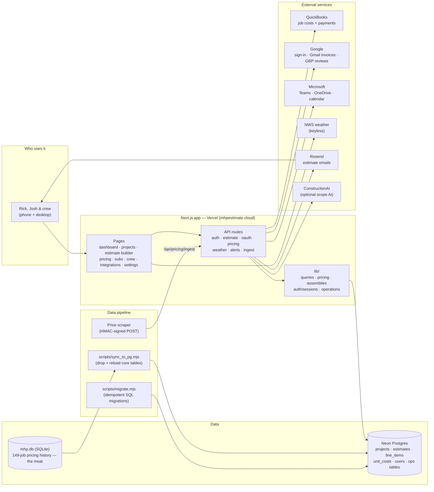

This is a [Next.js](https://nextjs.org) project bootstrapped with [`create-next-app`](https://nextjs.org/docs/app/api-reference/cli/create-next-app).

## System overview

MHP Brain — the operating app for North Mississippi Home Professionals, live at
`mhpestimate.cloud` (Next.js 16 on Vercel, Neon Postgres).



## Getting Started

First, run the development server:

```bash
npm run dev
# or
yarn dev
# or
pnpm dev
# or
bun dev
```

Open [http://localhost:3000](http://localhost:3000) with your browser to see the result.

You can start editing the page by modifying `app/page.tsx`. The page auto-updates as you edit the file.

This project uses [`next/font`](https://nextjs.org/docs/app/building-your-application/optimizing/fonts) to automatically optimize and load [Geist](https://vercel.com/font), a new font family for Vercel.

## Authentication: sign-up, sign-in, password reset

Sign-in is at `/login` (email + password, plus Google / Microsoft / QuickBooks). Three self-service
screens back it:

- **`/signup` — create account.** New accounts are created **inactive ("pending admin approval")**
  with the `viewer` role. They cannot sign in until an admin activates them, so registration never
  grants access to company data on its own. The form always reports the same success (it never
  reveals whether an email is already registered).

  Approve a pending user (set `active = 1`, optionally bump their role):

  ```sql
  -- see who's waiting
  SELECT id, name, email, created_at FROM users WHERE active = 0 ORDER BY created_at;
  -- activate (and optionally promote)
  UPDATE users SET active = 1, role = 'field' WHERE email = 'them@example.com';
  ```

- **`/forgot` — request a reset.** Emails a single-use, 1-hour reset link to active accounts. Always
  reports the same success (no account enumeration).

- **`/reset?token=…` — set a new password.** Validates the token, rotates the password, and
  invalidates all of that user's existing sessions.

### Email (SMTP)

Reset emails go out over SMTP, configured entirely from env. **Until these are set, the reset flow
still works** — the link is written to the server logs (`[forgot-password] … Reset link: …`) so an
admin can retrieve it. Set them to send real email:

| Var          | Notes                                                            |
| ------------ | ---------------------------------------------------------------- |
| `SMTP_HOST`  | e.g. `smtp.gmail.com`, `smtp.sendgrid.net`                       |
| `SMTP_PORT`  | `587` (STARTTLS, default) or `465` (implicit TLS)               |
| `SMTP_USER`  | login / API-key username                                         |
| `SMTP_PASS`  | password / app-password / API key                               |
| `SMTP_FROM`  | optional, e.g. `MHP Construction <no-reply@mshomepros.com>`      |
| `SMTP_SECURE`| optional, `1` to force implicit TLS                              |
| `APP_URL`    | optional, base for reset links (otherwise derived from request) |

Run `node scripts/migrate.mjs` after deploying to create the `password_resets` table.

## Learn More

To learn more about Next.js, take a look at the following resources:

- [Next.js Documentation](https://nextjs.org/docs) - learn about Next.js features and API.
- [Learn Next.js](https://nextjs.org/learn) - an interactive Next.js tutorial.

You can check out [the Next.js GitHub repository](https://github.com/vercel/next.js) - your feedback and contributions are welcome!

## Deploy on Vercel

The easiest way to deploy your Next.js app is to use the [Vercel Platform](https://vercel.com/new?utm_medium=default-template&filter=next.js&utm_source=create-next-app&utm_campaign=create-next-app-readme) from the creators of Next.js.

Check out our [Next.js deployment documentation](https://nextjs.org/docs/app/building-your-application/deploying) for more details.
